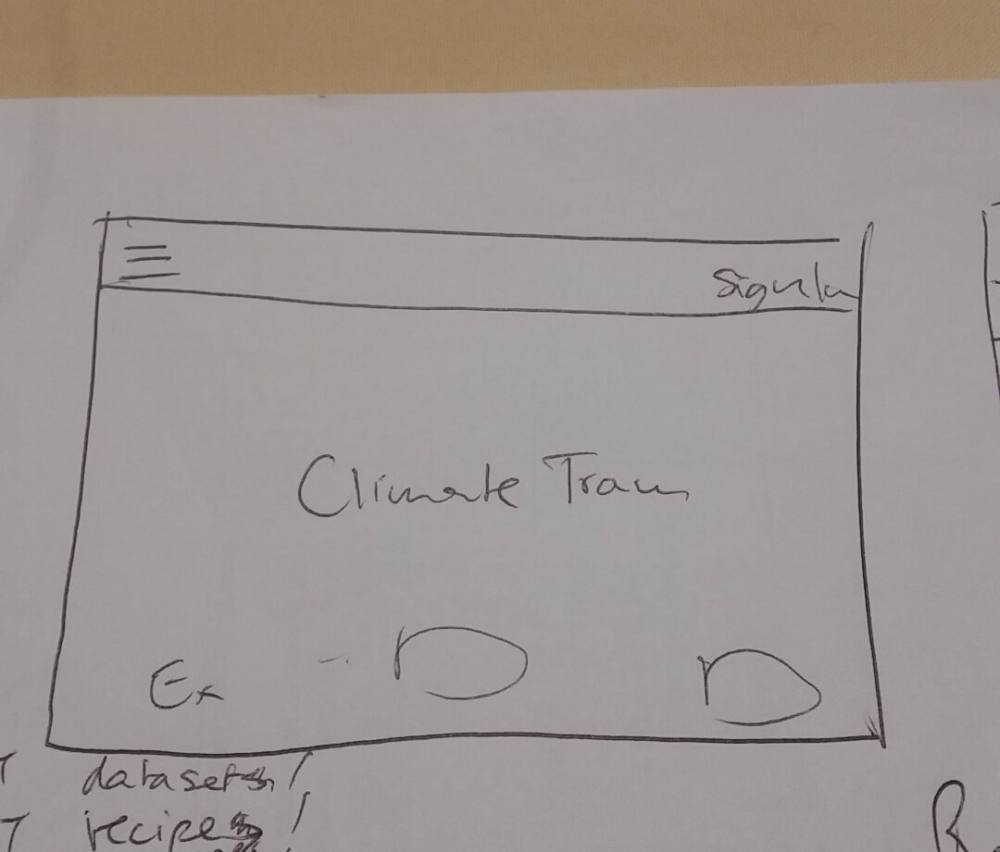
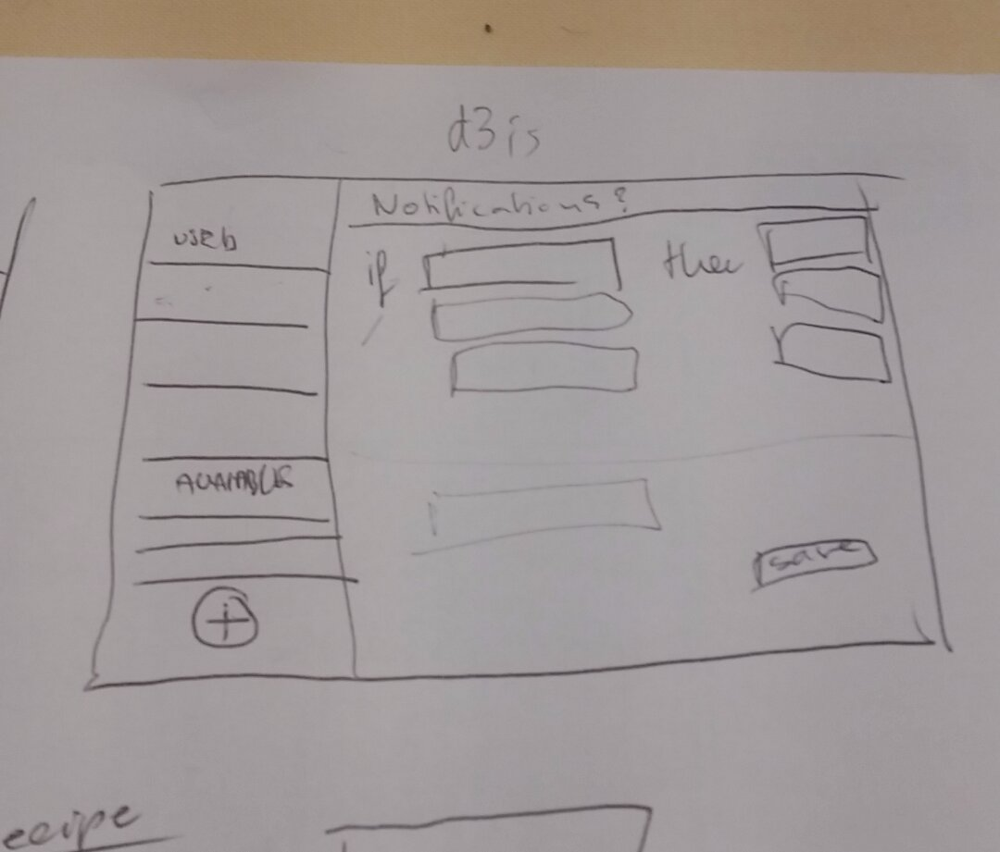
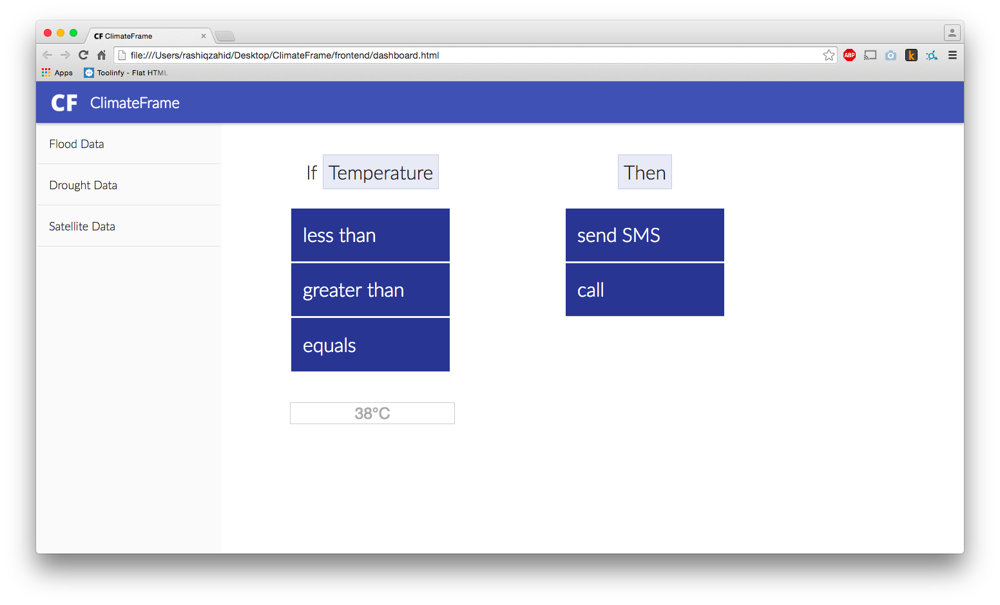
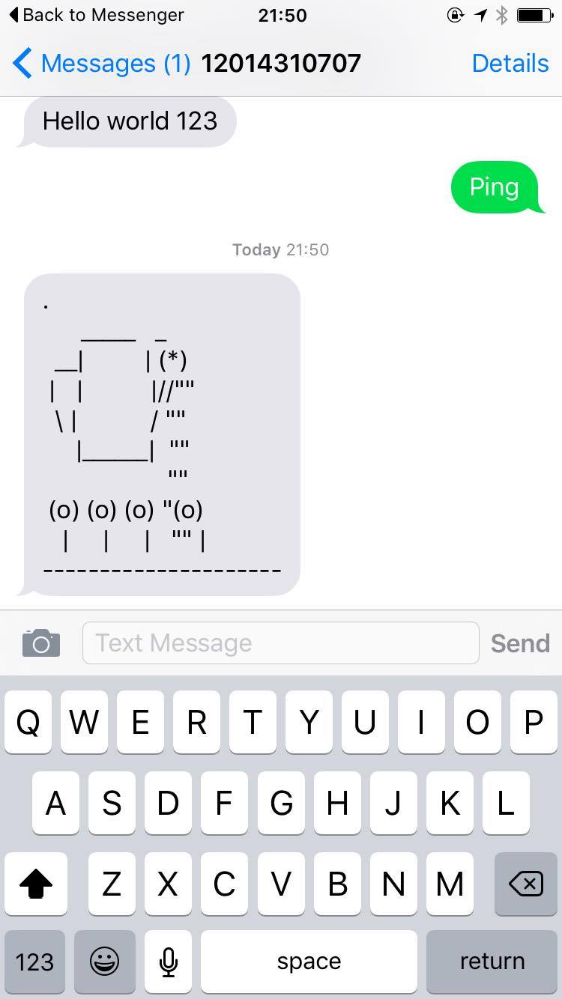
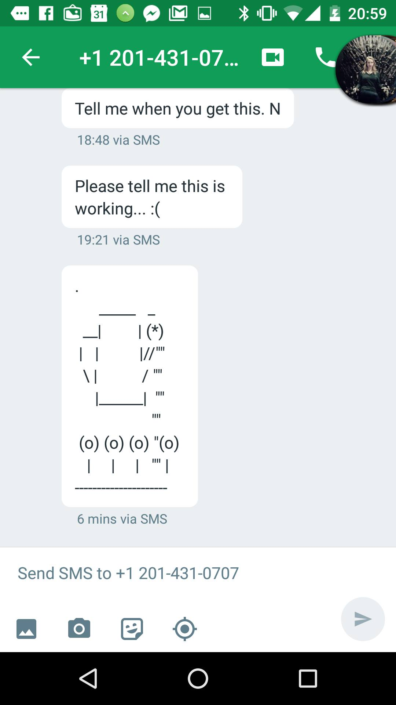

# Progress Update - Day 1 Summary

ClimateFrame: Progress Report
-----------------------------

ClimateFrame Project Overview: https://climateaction.io/climateframe-introduction/
Code Repository: https://github.com/climate-action-hackathon/ClimateFrame

During the first day we heard about a lot of issues. One such issue was that there were a lot of similar system that intend to bridge the gap between datasets and vulnerable communities. However, there are several problems we have found with this:
    * There are difficulties in combining datasets with the knowledge of local experts
    * There are difficulties in communicating effectively and in automatically issuing warnings or informing communities
    * There are problems with monetization and sustainability. Poor Person Pays (PPP) does not work

We started the day by iterating on how to best address these issues. We thought about the users, the direct stakeholders, and the indirect stakeholders. Thus we came up with a first basic design:
     
    

We split up the work into front end and back end. The front end now looks like this:
     

The back end is integrated with the Parse API which allows us to get forecast data. Predefined conditions schemes have been added that allow queries such as "Is the temperature bigger than X". It is also possible to define actions that are to be taken if one of those conditions evaluated to true. The condition schemes along with the actions are combined into *recipes* that are saved as to mongodb. These recipes are checked every hour based on scheduled jobs.

As a last part the Twilio API was integrated. As such it is now possible to sign up for a service by calling a number and it is possible for messages to be sent to everyone that is enrolled in the service.
     
        

The work that remains is to make sure all system components work together properly.
